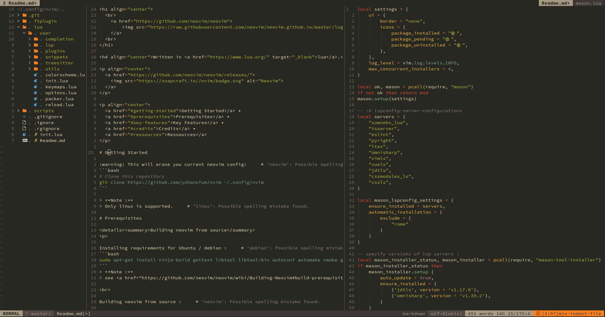

<h1 align="center">
  <br>
	<a href="https://github.com/neovim/neovim">
		
	</a>
  <br>
</h1>

<h4 align="center">Written in <a href="https://www.lua.org/" target="_blank">lua</a>.</h4>

<p align="center">
  <a href="https://github.com/neovim/neovim/releases/">
    
  </a>
</p>

<p align="center">
  <a href="#getting-started">Getting Started</a> •
  <a href="#prerequisites">Prerequisites</a> •
  <a href="#key-features">Key Features</a> •
  <a href="#credits">Credits</a> •
  <a href="#ressources">Ressources</a>
</p>



# Getting Started

:warning: This will erase you current neovim config!
```bash
# Clone this repository
git clone https://github.com/yohannTum/nvim ~/.config/nvim
```

> **Note :**
> Only linux is supported.

# Prerequisites

<details><summary>Building neovim from source</summary>
<p>

Installing requirements for Ubuntu / debian :
```bash
sudo apt-get install ninja-build gettext libtool libtool-bin autoconf automake cmake g++ pkg-config unzip curl doxygen
```
> **Note :**
> see <a href="https://github.com/neovim/neovim/wiki/Building-Neovim#build-prerequisites" target="_blank">build-prerequisites</a> if you are using a different distro.

<br>

Building neovim from source :

```bash
git clone https://github.com/neovim/neovim.git ~/neovim
cd ~/neovim
git checkout release-0.8
make CMAKE_BUILD_TYPE=Release
sudo make install
```
> **Note :**
> [Official documentation](https://github.com/neovim/neovim/wiki/Installing-Neovim#install-from-source)

</p>
</details>

<details><summary>Binaries</summary>
<p>

Required binaries :
```
- pandoc
- java (sdk 17)
- fd
- fzf
```

Ubuntu :
```bash
sudo apt install fd-find openjdk-17-jdk fzf pandoc
```
</p>
</details>

<details><summary>Nerdfonts</summary>
<p>

Setting up a [patched nerd font](https://www.nerdfonts.com/)
```bash
mkdir -p ~/.local/share/fonts/Source_Code_Pro
cd ~/.local/share/fonts/Source_Code_Pro/
# Choose the font you want from : https://www.nerdfonts.com/font-downloads
wget https://github.com/ryanoasis/nerd-fonts/releases/download/v2.2.2/SourceCodePro.zip
unzip SourceCodePro.zip
sudo fc-cache -f # Refresh fonts
```
> **Note :**
> patching your own font : [github.com/ryanoasis/nerd-fonts](https://github.com/ryanoasis/nerd-fonts#font-patcher)

Enabling it in your terminal (alacritty.yml)
```yml
font:
  normal:
    # Font family
    family: SauceCodePro Nerd Font
    style: Regular
  bold:
    family: SauceCodePro Nerd Font
    style: Bold
  italic:
    family: SauceCodePro Nerd Font
    style: Italic
  bold_italic:
    family: SauceCodePro Nerd Font
    style: Bold Italic
```
</p>
</details>

<details><summary>Terminal true colors support</summary>
<p>

Tests to check for true colors :
```bash
cd scripts
./24-bit-color.sh
# or
./check_true_color.sh
# should see smooth gradients when running this script in the terminal
# https://jdhao.github.io/2018/10/19/tmux_nvim_true_color/#fn:2
# https://gist.github.com/andersevenrud/015e61af2fd264371032763d4ed965b6
```

Tmux true colors (alacritty?):

```bash
# https://jdhao.github.io/2018/10/19/tmux_nvim_true_color/
set -g default-terminal "tmux-256color"
set -ag terminal-overrides ",xterm-256color:RGB" # tmux 3.2
# set -sa terminal-overrides ',xterm-256color:Tc' # any tmux version
```

</p>
</details>

# Key Features

* Colorschemes
	- [X] Gruvbox
* LSP support for :
	- [X] Next.js (tsserver)
	- [X] Java (jdtls)
	- [X] lua (sumneko_lua)
	- [X] python (pyright)
	- [ ] c++ (ccls)
	- [ ] dotnet (omnisharp)
	- [ ] java tests (jdtls)
	- [ ] docker
	- [ ] latex
	- [ ] vue.js
* Telescope
* Whichkey
	- [ ] Description not in whichkey config
	- [ ] On attach : packer, Telescope...
* Github
	- [ ] git keymaps
	- [ ] ui integration
* nvim-dap
	- [ ] Setup
* null-ls / linter
	- [ ] Setup
* pinned packer's plugins
	- [ ] Done
* Nvim-tree global for all tabs
	- [ ] Global for all tabs with [barbar.nvim](https://github.com/romgrk/barbar.nvim#integration-with-filetree-plugins) or [this thread](https://www.reddit.com/r/neovim/comments/sey7l9/file_tree_as_a_sidebar/)?
* [Airline.vim](https://github.com/vim-airline/vim-airline)
	- [ ] Move to [lualine](https://github.com/nvim-lualine/lualine.nvim) for lsp support

# Credits
- [nvim-basic-ide](https://github.com/LunarVim/nvim-basic-ide) ([Chris@Machine](https://github.com/ChristianChiarulli))
- [LunarVim](https://github.com/LunarVim/LunarVim) ([Chris@Machine](https://github.com/ChristianChiarulli))

# Ressources
